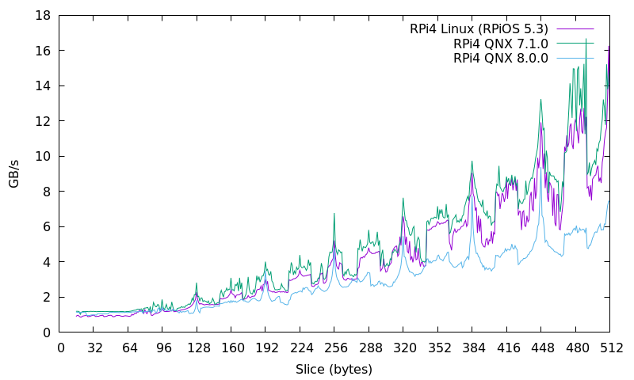

# Interpreting the Results <!-- omit in toc -->

- [1. Parsing the Results](#1-parsing-the-results)
  - [1.1. Reading the JSON file](#11-reading-the-json-file)
  - [1.2. Generating a Graph](#12-generating-a-graph)
- [2. Results](#2-results)
  - [2.1. i9-13980HX (Ubuntu 22.04; GCC 12.3.0)](#21-i9-13980hx-ubuntu-2204-gcc-1230)
  - [2.2. i3-2120T (Ubuntu 22.04; GCC 11.4.0)](#22-i3-2120t-ubuntu-2204-gcc-1140)
  - [2.3. i7-4930K (Ubuntu 20.04; GCC 9.3.0)](#23-i7-4930k-ubuntu-2004-gcc-930)
  - [2.4. Intel Core2 Duo T7700 (Debian Bullseye; GCC 10.2.1)](#24-intel-core2-duo-t7700-debian-bullseye-gcc-1021)
  - [2.5. Raspberry Pi4 (RPi OS 5; GCC 12.2.0)](#25-raspberry-pi4-rpi-os-5-gcc-1220)
  - [2.6. Raspberry Pi5 (RPi OS 5; GCC 12.2.0)](#26-raspberry-pi5-rpi-os-5-gcc-1220)

## 1. Parsing the Results

### 1.1. Reading the JSON file

The JSON file in this folder is obtained by running the command

```sh
./analyse.py <file.json> 256 > <file.txt>
```

This will read the output of the `.json` file generated by Google Benchmark and
parse the results so that they can be interpreted in the same way documented by
[Measuring the size of the cache line
empirically](https://lemire.me/blog/2023/12/12/measuring-the-size-of-the-cache-line-empirically/).

The first column is the slice. The second column is the "GB/s" which is
calculated to be `SIZE / (time (ns) / slice)`.

The `SIZE` is part of the test case. This is by default 256MB. The `-b` option
overrides this.

THe `slice` is obtained from the test case name `BM_CopyStride/<slice>`.

Then one can plot the results with GB/s on the y-axis, and the slice on the
x-axis.

### 1.2. Generating a Graph

Using gnuplot we can generate a graph to see the cache-line.

```sh
gnuplot -e "INPUT_DATA='<file>.txt'; OUTPUT_IMG='<file>.png'" ./graph.gnuplot
```

## 2. Results

### 2.1. i9-13980HX (Ubuntu 22.04; GCC 12.3.0)

The results here use 256MB arrays, as the L3 cache is 36MB. The graph is flat,
until after 64MB, and then increases linearly.

```sh
sudo cpupower frequency-set --governor performance
taskset -c 0 cacheline_bench --benchmark_out=i9-13980hx_256M.json --benchmark_out_format=json --benchmark_min_time=5s

analyse.py i9-13980hx_256M.json 256 > i9-13980hx_256M.txt
gnuplot -e "INPUT_DATA='i9-13980hx_256M.txt'; OUTPUT_IMG='i9-13980hx_256M.png'" ./graph.gnuplot
```


This shows that there is a 64-byte cache-line.

### 2.2. i3-2120T (Ubuntu 22.04; GCC 11.4.0)

The results here use 8MB arrays, as the L3 cache is 3MB.

```sh
sudo cpupower frequency-set --governor performance
taskset -c 1 cacheline_bench --benchmark_out=i3-2120t_8M.json --benchmark_out_format=json --benchmark_min_time=2s -b8

analyse.py i3-2120t_8M.json 8 > i3-2120t_8M.txt
gnuplot -e "INPUT_DATA='i3-2120t_8M.txt'; OUTPUT_IMG='i3-2120t_8M.png'" ./graph.gnuplot
```


From about 64b we see that the copies are slightly slower with a linear increase
from 64 to 256, and then a sharp increase.

### 2.3. i7-4930K (Ubuntu 20.04; GCC 9.3.0)

The results here use 32MB arrays as the L3 cache is 12MB.

```sh
sudo cpupower frequency-set --governor performance
taskset -c 2 ./benchmarks/cacheline/cacheline_bench --benchmark_out=i7-4930k_32M.json --benchmark_out_format=json --benchmark_min_time=2s -b32

analyse.py i7-4930k_32M.json 8 > i3-2120t_8M.txt
gnuplot -e "INPUT_DATA='i7-4930k_32M.txt'; OUTPUT_IMG='i7-4930k_32M.png'" ./graph.gnuplot
```


For this processor, it is more difficult to tell from the results, with a slight
increase after 64b, but more noticeable after 96b.

### 2.4. Intel Core2 Duo T7700 (Debian Bullseye; GCC 10.2.1)

```sh
sudo cpupower frequency-set --governor performance
taskset -c 1 ./benchmarks/cacheline/cacheline_bench --benchmark_out=intel-t7700_8M.json --benchmark_out_format=json --benchmark_min_time=2s -b8

analyse.py intel-t7700_8M.json 8 > intel-t7700_8M.txt
gnuplot -e "INPUT_DATA='intel-t7700_8M.txt'; OUTPUT_IMG='intel-t7700_8M.png'" ./graph.gnuplot
```


### 2.5. Raspberry Pi4 (RPi OS 5; GCC 12.2.0)

```sh
sudo cpupower frequency-set --governor performance
taskset -c 1 ./benchmarks/cacheline/cacheline_bench --benchmark_out=rpi4_8M.json --benchmark_out_format=json --benchmark_min_time=2s -b8

analyse.py rpi4_8M.json 8 > rpi4_8M.txt
gnuplot -e "INPUT_DATA='rpi4_8M.txt'; OUTPUT_IMG='rpi4_8M.png'" ./graph.gnuplot
```



The Raspberry Pi 4 has a cache-line of 64b.

### 2.6. Raspberry Pi5 (RPi OS 5; GCC 12.2.0)

```sh
sudo cpupower frequency-set --governor performance
taskset -c 1 ./benchmarks/cacheline/cacheline_bench --benchmark_out=rpi5_8M.json --benchmark_out_format=json --benchmark_min_time=2s -b8

analyse.py rpi5_8M.json 8 > rpi5_8M.txt
gnuplot -e "INPUT_DATA='rpi5_8M.txt'; OUTPUT_IMG='rpi5_8M.png'" ./graph.gnuplot
```


The Raspberry Pi 5 has a cache-line of 64b.
