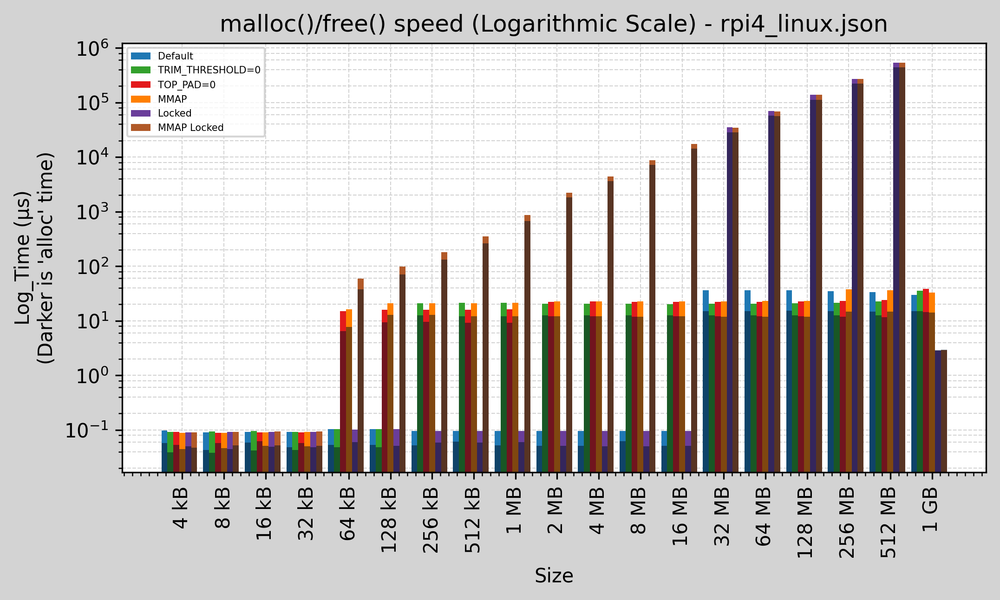
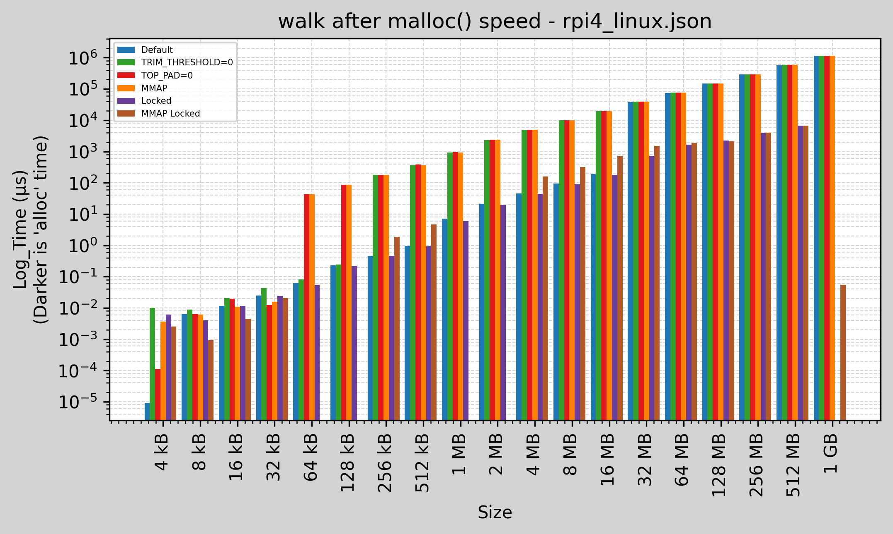
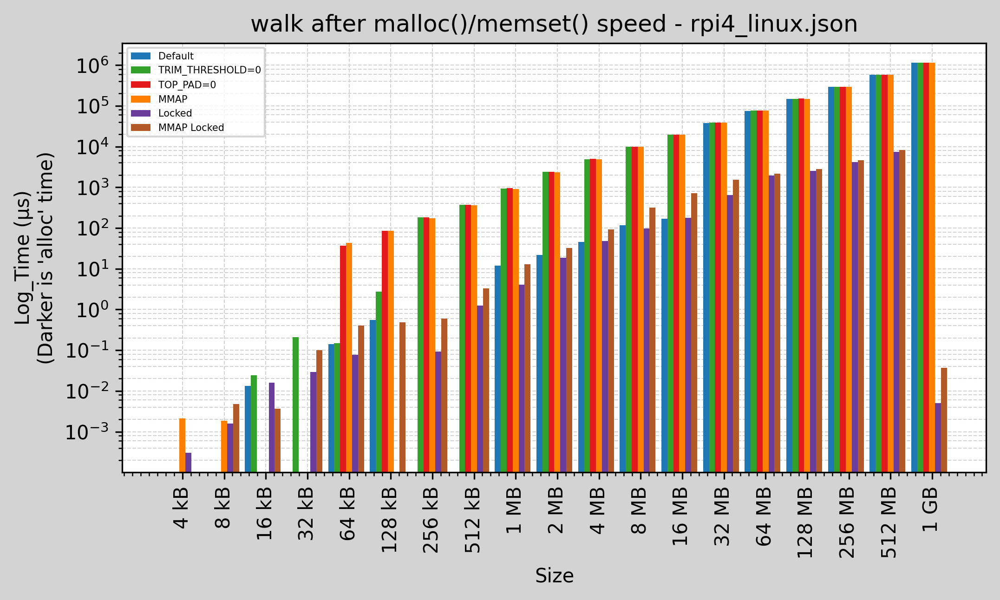
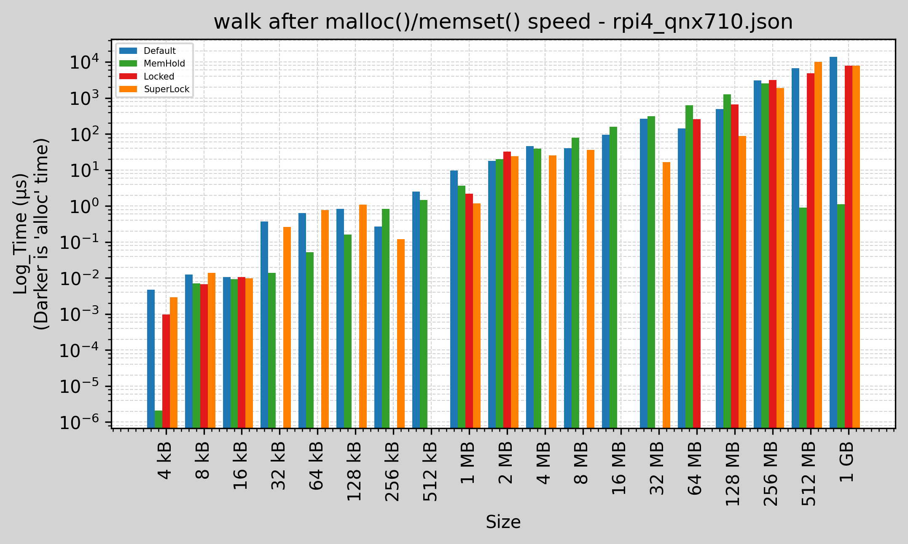
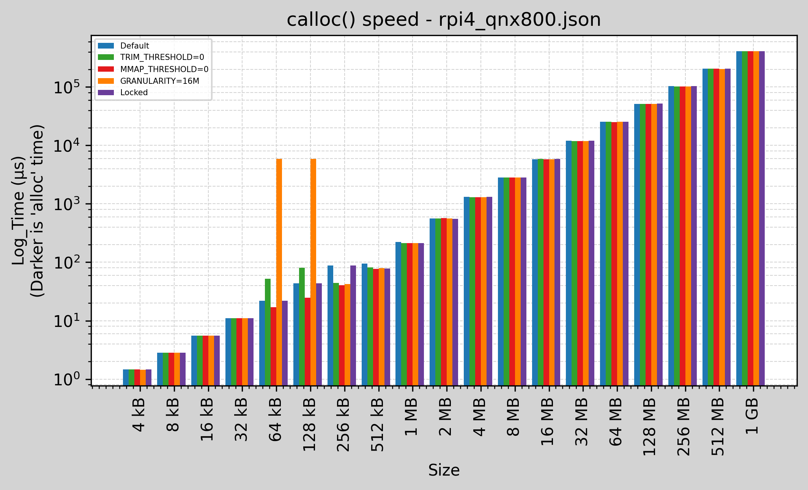
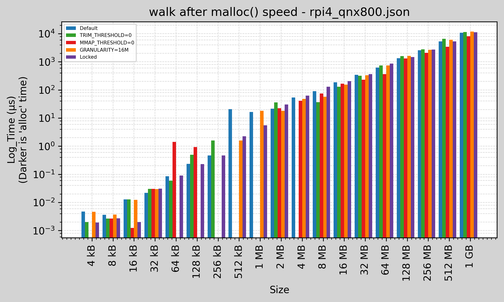
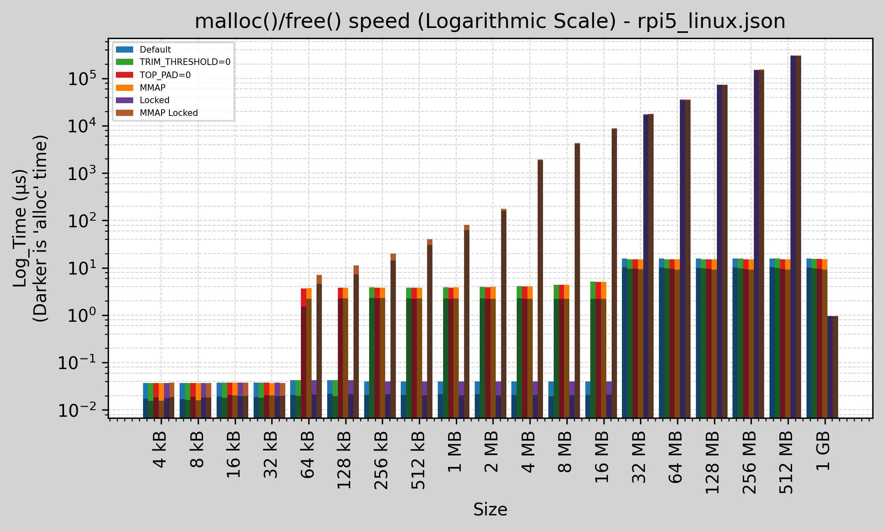
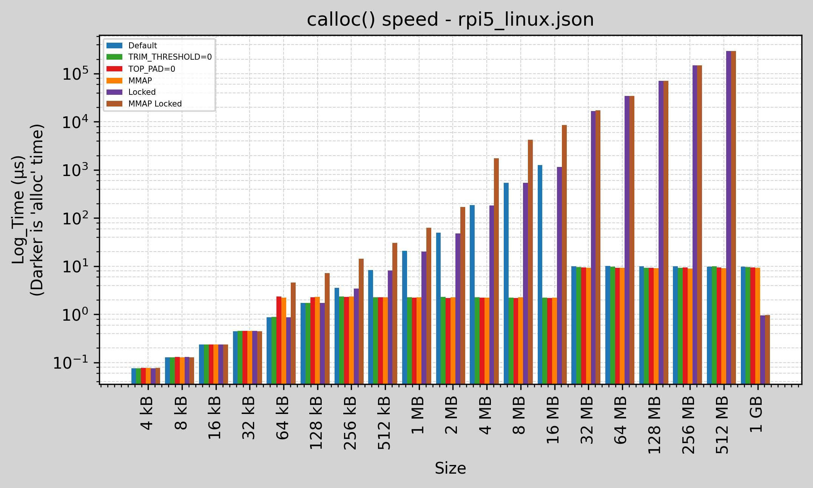
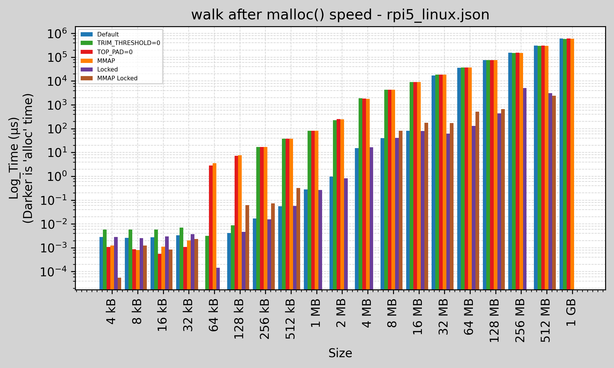
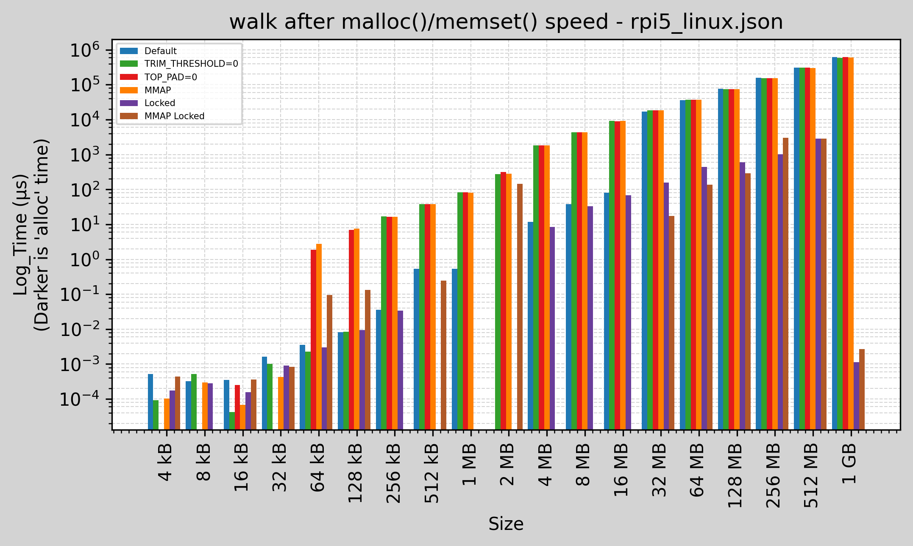

# Results <!-- omit in toc -->

Outputs are generated by running the `malloc_bench` tool on the target. Various
options are given and used to compare.

Generating the graphs are the results of the Google Benchmark output JSON files,
which are then parsed through a [Jupyter Notebook](./analyse.ipynb). This reads
a configuration file you can modify in the notebook, and finally
[MatPlotLib](https://matplotlib.org/) to generate the graphs.

- [1. Linux Measurements](#1-linux-measurements)
  - [1.1. Parameters used for Plots](#11-parameters-used-for-plots)
  - [1.2. Bar Graphs](#12-bar-graphs)
- [2. Linux Results](#2-linux-results)
  - [2.1. Conclusions](#21-conclusions)
  - [2.2. Intel i9-13950HX - 32GB (Ubuntu 22.04; GCC 11.4.0; Linux 6.8.0-40-generic; Ubuntu GLIBC 2.35-0ubuntu3.8)](#22-intel-i9-13950hx---32gb-ubuntu-2204-gcc-1140-linux-680-40-generic-ubuntu-glibc-235-0ubuntu38)
  - [2.3. Raspberry Pi 4 - 2GB (Linux)](#23-raspberry-pi-4---2gb-linux)
  - [2.4. Raspberry Pi 4 - 2GB (QNX 7.1.0)](#24-raspberry-pi-4---2gb-qnx-710)
  - [2.5. Raspberry Pi 4 - 2GB (QNX 8.0.0)](#25-raspberry-pi-4---2gb-qnx-800)
  - [2.6. Raspberry Pi 5 - 8GB (Linux)](#26-raspberry-pi-5---8gb-linux)

## 1. Linux Measurements

### 1.1. Parameters used for Plots

Under Linux, various tests are done with the following `mallopt()` options:

- `M_MTRIM_THRESHOLD` = 0

  Modifying `M_TRIM_THRESHOLD` is a trade-off between increasing the number of
  system calls (when the parameter is set low) and wasting unused memory at the
  top of the heap (when the parameter is set high).

  The default value for this parameter is 128*1024.

  By setting to zero, the `free()` system call will internally use the `sbrk()`
  system call always to reduce the amount of memory in the heap, giving it back
  to the system.

- `M_TOP_PAD` = 0

  Test results graphs include `M_MTRIM_THRESHOLD=0` already set in addition.

  Modifying `M_TOP_PAD` is a trade-off between increasing the number of system
  calls (when the parameter is set low) and wasting unused memory at the top of
  the heap (when the parameter is set high).

  The default value for this parameter is 128*1024.

  When the heap is trimmed as a consequence of calling `free()`, zero bytes are
  preserved at the top of the heap. When memory is allocated, zero bytes are
  added to the `sbrk()` request. If not present, a malloc would add 128kB
  (default) `sbrk()` in addition.

  Using this parameter, we should see more memory allocations to the system.

- `M_MMAP_THRESHOLD` = 0 (`MMAP` in the graphs)

  All allocations that can't be satisfied from the free list will employ
  `mmap()` instead of increasing the program break using `sbrk()`.

  Allocating memory using `mmap()` has the significant advantage that the
  allocated memory blocks can always be independently released back to the
  system. (By contrast, the heap can be trimmed only if memory is freed at the
  top end.)  On the other hand, there are some disadvantages to the use of
  `mmap`: deallocated space is not placed on the free list for reuse by later
  allocations; memory may be wasted because `mmap` allocations must be
  page-aligned; and the kernel must perform the expensive task of zeroing out
  memory allocated via `mmap`.

  The default setting for this parameter is 128*1024.

Because Linux lazy locks pages (the pages are created in the process space, but
not allocated which will lead to page faults when they're first accessed),
additional tests are done with the `mlockall()` API, reserving the current and
all future pages.

### 1.2. Bar Graphs

For the `malloc()` graphs, there are two values shown per parameter set:

- The total time required to do the `malloc()` and `free()`
- The darker (smaller) line is the time required to do the `malloc()` only.
  - The upper portion is then the time required for the `free()`.

Bar graphs are logarithmic along the x-axis (the memory size doubles each time),
and along the y-axis. This shows the cases where the time to allocate memory is
proportional to the memory size being requested.

This creates an interesting effect. The dark bar is the `malloc()` time. The
light bar is the time for `malloc()` and `free()`. While the distance between
the dark and light bars is very small, they are in reality of about the same
order of magnitude. The distortion is due to having logarithmic graphs. Having
linear graphs will prevent the smaller memory allocation sizes being visible.

For the `calloc()` graphs, only the time for the `calloc()` is shown. The time
for `free()` is the same as `malloc()` and does not need to be plotted.

## 2. Linux Results

The easiest way to generate the results are:

- Build

  ```sh
  mkdir build && cd build
  cmake -B . -S .. -DCMAKE_BUILD_TYPE=Release
  make -j32
  ../benchmark/malloc/results/run_linux.sh myrun | tee myrun.txt
  ```

- Copy the results to the `results\myrun\` folder
- Create a `results\myrun.json` linking with the plot names and the files
- Run the [Jupyter Notebook](./analyse.ipynb) updating the `CONFIG_FILE`.

### 2.1. Conclusions

The default configuration, without using `mlockall()`, the `malloc()` speed on
Linux is quite fast.

- The default settings (blue bar) appear to be very fast at allocations up to
  and including 16MB. Thereafter the performance is similar to all other
  `mallopt()` options used.
- 32kB and less, all options seemed to use memory that is in the system, so this
  is stressing the heap allocator for constant allocations and free.
- The `M_MTRIM_THRESHOLD=0` and `M_TOP_PAD=0` (red bar) use the `sbrk()`
  mechanism which causes memory to be always freed back to the system from 64kB
  and up. This indicates a lower bound of 32kB, and not zero bytes.
- The `M_MTRIM_THRESHOLD=0` (green bar) with the default `M_TOP_PAD=128kB` shows
  fast allocations up to and including 128kB. From 256kB it appears that memory
  is freed back to the system using the `sbrk()` mechanism.
- Using `M_MMAP_THRESHOLD=0` to use `mmap()` always (orange bar) appears to be
  the same cost as using the `sbrk()` mechanism, that it is the same as the red
  bar.
- Locking memory (purple and brown) shows the slowest memory allocation, where
  not only the memory must be mapped, but the pages must be allocated. As
  expected the time is linearly proportional to the amount of memory requested
  (unless kept in the heap). The Locked and Default both have the same settings,
  except for using locked memory.

Allocating zero memory with `calloc()`, one would expect that the memory is
zero. That means something must write the memory to have the value zero before
giving to the application.

- For memory not locked (from 32MB onwards), the speed is constant at about
  10µs. It is clear this memory is not being paged. The walk test shows much
  slower access of the memory.

Locked memory is much faster when accessing and walking obviously (no page
faults), but cost more time to allocate upfront.

### 2.2. Intel i9-13950HX - 32GB (Ubuntu 22.04; GCC 11.4.0; Linux 6.8.0-40-generic; Ubuntu GLIBC 2.35-0ubuntu3.8)

```sh
sudo cpupower frequency-set --governor performance
taskset -c 1 malloc_bench --benchmark_out_format=json --benchmark_out=i9-13950hx_XXXX.json
```


### 2.3. Raspberry Pi 4 - 2GB (Linux)








### 2.4. Raspberry Pi 4 - 2GB (QNX 7.1.0)

This is using the default configuration of `procnto-smp-instr` without
superlocking enabled, except for the graph with superlocking that uses the
option `-mL` on the command line of `procnto-smp-instr`.




### 2.5. Raspberry Pi 4 - 2GB (QNX 8.0.0)

This is using the default configuration of `procnto-smp-instr` without
superlocking enabled.







### 2.6. Raspberry Pi 5 - 8GB (Linux)








