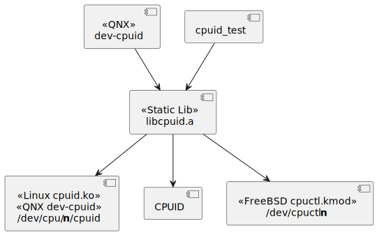
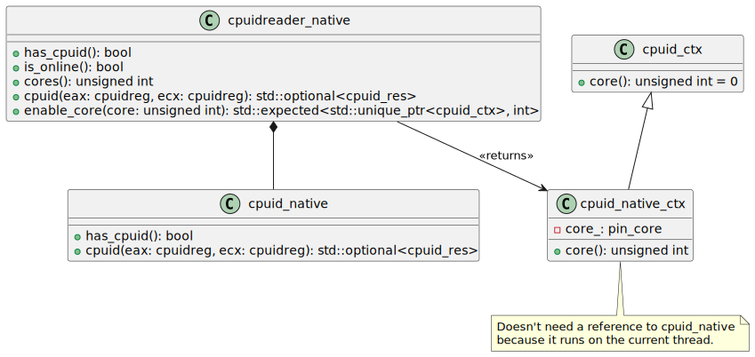
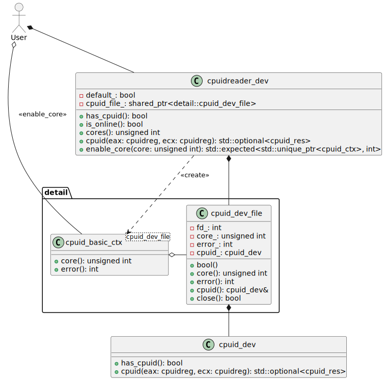
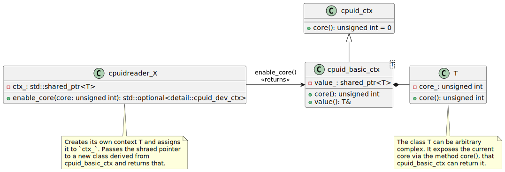

# Introduction <!-- omit in toc -->

The subproject `cpuid-x86` is a simple tool to query the CPUID information on
x86 computers. It consists of a cross platform library to allow multiple ways to
query the CPUID, from the CPUID instruction, to device drivers that do the
query.

It has little practical use except to dump information in various ways. One
observation is that testing on a tool such as `valgrind` returns emulated
results for the CPUID instruction, where using a kernel provided device driver
provides the correct results.

- [1. Component Design](#1-component-design)
- [2. Library Detailed Design](#2-library-detailed-design)
  - [2.1. Implementation Specific CPUID](#21-implementation-specific-cpuid)
  - [2.2. CPUID Context](#22-cpuid-context)
    - [2.2.1. Managing a Context](#221-managing-a-context)
    - [2.2.2. Common Implementation of a Context](#222-common-implementation-of-a-context)
  - [2.3. Dumping](#23-dumping)
- [3. Usage Examples](#3-usage-examples)
  - [3.1. Instantiating a Reader](#31-instantiating-a-reader)
  - [3.2. Querying the Reader](#32-querying-the-reader)
  - [3.3. Querying a CPUID](#33-querying-a-cpuid)

## 1. Component Design

The main work is done by the `libcpuid` library, which is specific for the x86
processor. Other components build on top of the library to get CPUID information.



## 2. Library Detailed Design

The `libcpuid` C++17 static library is designed to be built depending on the
features available from the Operating System. It provides multiple
implementations that a user can choose, depending how they wish to get the
information.

Reading the CPUID via the Intel instruction `cpuid` is done with the class
`cpuidreader_native`.



Reading the CPUID via the Linux kernel module `cpuid.ko` is done with the class
`cpuidreader_dev`.



### 2.1. Implementation Specific CPUID

The classes `cpuidreader_*` are intended to be the classes that are instantiated
to read the CPUID information. They all offer the same methods, that makes them
suitable for template programming:

- `has_cpuid()` indicates if the class is capable of returning results.
- `is_online()` indicates if the results are for the current.
- `cores()` the number of cores available to query.
- `cpuid()` query the CPUID results for the leaf and subleaf.
- `enable_core()` provide a context, that when destroyed, releases the context,
  for querying the CPUID.

### 2.2. CPUID Context

The context is specific to each implementation of `cpuidreader_*`. The context
should be used to ensure the results for querying the CPUID instruction occurs
on a specific core. There should only be one context active at any one time
(nested contexts should not be allowed, but may not result in an error either).

Essentially, running the method `cpuid()` without a context, returns a default
result, depending on the implementation (e.g. always core 0, or the current
thread, whatever makes sense for that specific implementation).

When CPUID information is needed for a specific core, one generates a context
through the `enable_core()` method. That returns an object, and so long as that
object is alive, calls to `cpuid()` are valid for that context.

- For the `cpuidreader_native` implementation, it configures the current
  executing thread to be pinned on a specific core. While the context is active,
  then the thread can only run on a specific core. Once the context is released,
  the original run-mask is resumed.
- For the `cpuidreader_dev` implementation, the context opens a specific device
  path `/dev/cpu/N/cpuid` which is used to query the CPUID information. The
  default context is to open core 0.

Each context returns the following fields:

- `core()` the core that the context is valid for.

Creating a new context while an existing context is open results in undefined
behaviour.

#### 2.2.1. Managing a Context

The `cpuidreader_native_ctx` is the simplest, because the context is maintained
by the Operating System. It just asks the OS to pin the current thread. On
destruction, it pins to the original threads before the context was created.

Otherwise, maintaining a context relies on an interaction between the
`cpuidreader_xx`, a common state shared between the `cpuidreader_xx` that must
know what core to read, and a context that when destroyed, lets the
`cpuidreader_xx` know that the default context (normally core 0) is to be used
when `cpuid()` is called.

The generic implementation is:

- `cpuidreader_X` creates a `shared_ptr<data> ctx_` and stores it locally.
- `cpuidreader_X` passes the `shared_ptr<data> ctx_` by value to a new
  `cpuid_X_ctx` which also stores the object (e.g. to `cpuid_basic_ctx` that is
  provided for this purpose).
- When `cpuidreader_x.cpuid()` is called
  - If `ctx_` is `nullptr`, then it uses the default core for context
  - If `ctx_` has a reference count of 1, then it releases `ctx_` so the
    reference count goes to zero, and uses the default core for context. It can
    also set `ctx_` to `nullptr`.
  - If `ctx_` has a reference count of more than 1, then the context is still
    active, and it retrieves the core from the shared pointer `ctx_`.

For `cpuidreader_dev`, it maintains a handle to an open file. When the context
is closed, the file handle isn't immediately closed (because the
`cpuidreader_dev` contains a reference to the context also, to actually get the
CPUID information via `cpuid()`). To ensure the file handle is closed, one must
destroy the `cpuidreader_dev`, not just the context. By keeping the file handle
open for the context, we can reuse the file handle if the core hasn't changed.

For `cpuidreader_cache`, the `ctx_` is a `shared_ptr<core_ctx>`, which just
maintains the current core.

#### 2.2.2. Common Implementation of a Context

Because the context behaviour of all `cpuidreader_*` classes should be similar,
a common templated class `cpuid_basic_ctx` is provided. It receives a copy of
shared data, the data shared between the context and the `cpuidreader_*` class.
It is handled as a shared pointer, which simplifies the reference counting. When
the context is removed, there is only a unique context in the `cpuidreader_*`
class which can then be safely removed. If the `cpuidreader_*` is destroyed
earlier than the context, the context is still preserved.



### 2.3. Dumping

The method `cpuid_dump` takes a `cpuidreader` and uses this to dump CPUID
information on the core specified. THe results are provided as a vector.

The implementation is reasonably simple, there is no generic interface. The
`cpuid_dump` queries the `cpuidreader` for the first leaf to get the brand
string. From this, it calls a specialised method internally to get all
information for that specific CPU.

Each CPU has methods for obtaining information, one per leaf. As CPU
implementations offer share the same specifications, dumping for an AMD might
call methods originally documented for dumping for an Intel.

With this, there are three files (no classes are created):

- `dump_generic.h` dump the regions 0x00000000 (normal), 0x80000000 (extended,
  defined by AMD), 0x40000000 (hypervisor extensions). Each block has the first
  register which defines the number of leaves, followed by the data. None of the
  dumping routines dump subleaves.
- `dump_intel.h` dump Intel specific registers. There are lots of overlap with
  AMD, so many methods here can be used by AMD and other CPUs also.
- `dump_amd.h` dump AMD specific registers.

## 3. Usage Examples

### 3.1. Instantiating a Reader

The test code contains excellent examples of how to use the library.

The main library to include is `cpuid/cpuid.h`. This contains the definition of
querying a CPUID register `cpuid_req`, and getting the result of the query
`cpuid_res`.

The base class for all CPUID read operations is the `cpuidreader` class. This is
the base class for all concrete implementations, and as an abstract class, it
can't be instantiated on its own.

To instantiate a CPUID reader, there is a concrete implementation:

- `cpuidreader_native` which uses the CPUID instruction in your program;
- `cpuidreader_dev` which uses the device `/dev/cpu/X/cpuid` to query the
  results.

There is a special implementation `cpuidreader_cache` that needs one of the
above classes, but caches the result, that a CPUID register doesn't need to be
queried more than once.

To create a CPUID reader:

```cpp
#include "cpuid/cpuidreader_native.h"

auto reader = make_cpuidreader<cpuidreader_native>();
```

The include for the specific implementation must include by nature
`cpuid/cpuid.h`. The `make_cpuidreader<T>` method returns a
`std::unique_ptr<T>`.

### 3.2. Querying the Reader

Once we have the reader, it's simple to see if it implements the CPUID
instruction with the method `has_cpuid()`. Reasons why it might not work, is the
device driver for querying the CPUID is not loaded (e.g. no path
`/dev/cpu/X/cpuid` for the `cpuidreader_dev` class).

```cpp
if (!reader->has_cpuid())
  std::cerr << "No CPUID\n";
```

The method `is_online()` can determine if the results are relevant for the
current running thread, or of the results are from somewhere else, such as a
file.

The number of cores supported is obtained by the `cores()` method.

### 3.3. Querying a CPUID

The query of the CPUID usually depends on the core that the thread is running
when done natively, or the device that is opened when using a device driver.

The method `cpuid)eax, ecx)` provides an implementation specific result
depending on the implementation. It might provide for the current thread, or it
might provide for the default core.

To specify the core that should be used when getting the CPUID information, one
creates a CPUID context with `enable_core(core)`.

```cpp
auto cpuid_context = reader->enable_core(1);
if (!cpuid_context) {
  std::cout << "Context error: " << cpuid_context.error() << "\n";
}
```

If there was an error, the result is the `errno` as shown above.

Once we have the context, it's a unique pointer, so it can be moved around. When
the context is destroyed, the system returns to the original state.

It is undefined behaviour to move the context beyond the current thread, and
depends on the implementation. For example, the `cpuidreader_native` will pin
the current thread. The `cpuidreader_dev` maintains a file handle to the device.
If your program must handle all implementations by taking a `cpuidreader`, it
should do all work on the current thread and destroy the context when it is
finished.

The context can tell you the current core that is pinned.

```cpp
std::cout << "Core :" << (*cpuid_context)->core() << "\n";
```

The first dereference is to get the expected value. This was used instead of
setting the `std::unique_ptr` to `nullptr`, so that error information can be
returned also.

Then the unique pointer to `cpuid_ctx` can be dereferenced, which should be only
done if the expected result has a value. Normally, you don't need to access the
context at all, but just let it be destroyed when the context is no longer
needed.

Once the context is available, querying the CPUID for the core defined by the
context is as simple as accessing the reader

```cpp
// The 'cpuid_context' defines the current core.
auto res = cpuid(0, 0);
if (!res) {
  std::cout << "Reading CPUID 0h failed\n";
}
```

While the `cpuidreader_native` is unlikely to fail, other implementations are
expected to, such as reading from a device driver, or reading from a file.

### Setting up Cpu Control on FreeBSD

Ensure to load the driver by modifying the file `/boot/loader.conf` with the
string:

```text
cpuctl_load="YES"
```

Then on restart, you should see the device

```text
/dev/cpuctl0
```
