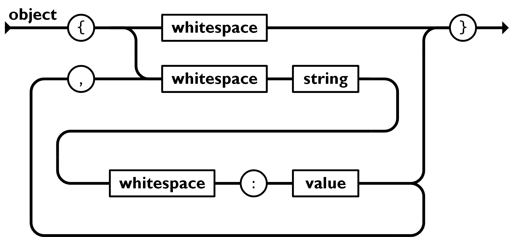
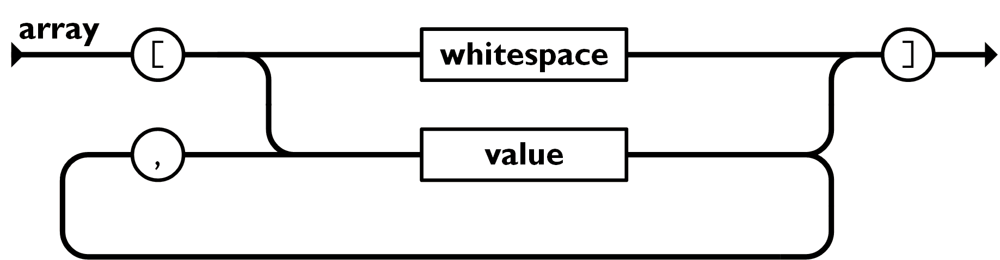
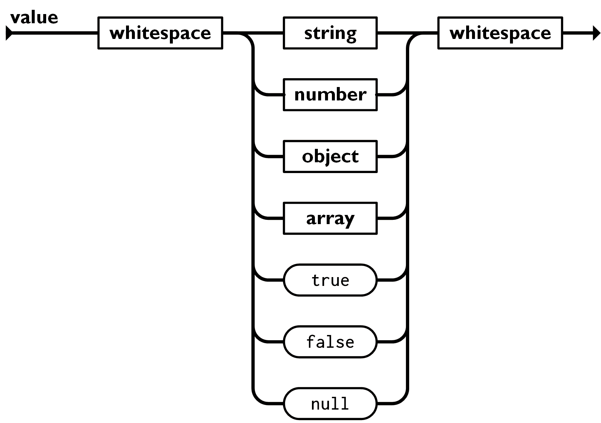
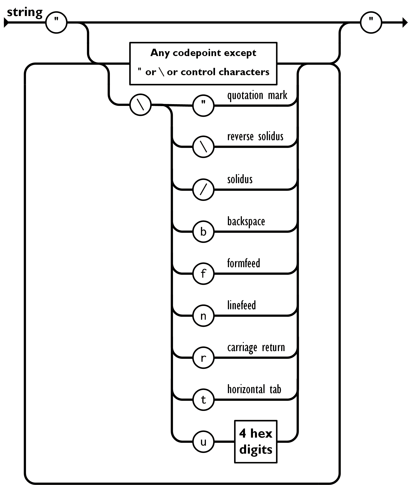
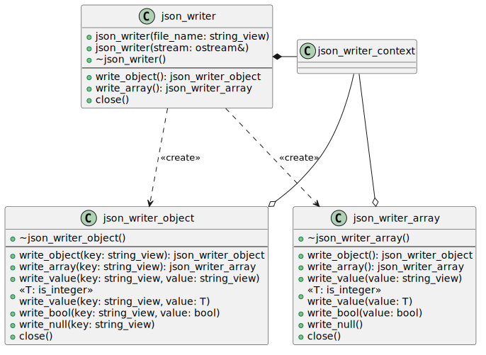

# Simple JSON Writer <!-- omit in toc -->

This library is a small implementation in C++17 to write JSON to a stream. The
class is intended to be simple to use and check against misuse.

The model of the writer is to write to a stream without an intermediate DOM
(Document Object Model). It is therefore intended for small implementations
needing also a small writer.

- [1. Usage](#1-usage)
- [2. Dependencies](#2-dependencies)
- [3. Class Design](#3-class-design)
  - [3.1. JSON File Format](#31-json-file-format)
  - [3.2. JSON Class Diagram](#32-json-class-diagram)
  - [3.3. Class Copy Semantics](#33-class-copy-semantics)
  - [3.4. Move Semantics](#34-move-semantics)
  - [3.5. Memory Management](#35-memory-management)
  - [3.6. Checks](#36-checks)

## 1. Usage

The class diagrams are next, but this section highlights the intended usage,
that influences the class design.

Only one class can be instantiated by the user. This is the `json_writer`. The
user provides a file name or a stream, which methods write to.

From the root object, we only allow writing either an `object` or an `array`.
The other elements mean only a single instance of a `value` which doesn't make
sense on its own. So the `json_writer` should provide methods to start an
`object` or an `array`.

The JSON file grammar is stacked, like a tree. The classes should allow function
calls to write the JSON object, like a tree in code.

Writing the `array` starts by starting a new array scope, then allows new
objects to be written as per the grammer. Similarly for when writing an
`object`.

The implementation should ensure that if object "1" starts writing an
object/array, resulting in object "2" coming in scope, then trying to write
another object/array from "1" while "2" is active results in an error.

This is unlike a DOM (Document Object Model), where objects are created in
memory first and then organised, relinked, etc. We are not writing a DOM.

## 2. Dependencies

The SJSON library dependencies should be kept only to the standard C++17
runtime.

## 3. Class Design

There is the base class `json_writer` which the user instantiates. From this
class, objects or arras are written.

### 3.1. JSON File Format

The file format is defined by
[RFC-7159](https://datatracker.ietf.org/doc/html/rfc7159). The usage of the
close should flow like the grammar. The class design should enforce the grammar.

<u>Object</u>:

<u>Array</u>:

<u>Value</u>:

<u>String</u>:

### 3.2. JSON Class Diagram

From the grammar, the following restrictions are placed on this implementation:

- From the `json_writer` object, one can create either:
  - `json_writer_object` for objects (or dictionaries); or
  - `json_writer_array` for writing arrays.

Writing outwrite values is not supported.

Observe that the two objects created from `json_writer` do not have public
constructors for the user.

### 3.3. Class Copy Semantics

The objects are not copyable. The style of writing the JSON file is imperative
and each method writes directly to the output stream.

### 3.4. Move Semantics

The objects should be movable. This allows moving the objects into function
calls, or into ownership by other classes.

Moving into other classes has very little benefit, unless omving the root.
Normally, one would provide a reference to a function call to write, or only
move with the intent that at the end of the function call, the object is closed.
The lifetime of each object crated from the `json_writer` root is expected to be
small, only long enough to write the file.

### 3.5. Memory Management

The three classes that the user sees, `json_writer`, `json_writer_array` and
`json_writer_object` are all placed on the stack. The amount of data they keep
is expected to be small.

The `json_writer` creates an object on the heap, the `json_writer_context`, as a
shared pointer. All classes would keep a copy of this shared pointer. The
context knows how to write to the stream, and checks the correctness of usage.

### 3.6. Checks

When the user creates a new element, say from `json_writer`, a
`json_writer_array` or a `json_writer_object`, then creating any new element
from the root should be disallowed.

That means, we must maintain a context of the current writer. This is the
purpose of the `json_writer_context` class.

The same is for when a new `json_writer_array` or a `json_writer_object` is
created from either an existing array or object.

To do this, the `json_writer` root class maintains a
`std::shared_ptr<json_writer_context>`. This context maintains the ability to
write to a stream.

When the root `json_writer` is closed, the stream is no longer used (it is
flushed, and if the stream is created from the `json_writer`, then the stream is
also closed).

All objects, `json_writer_object` and `json_writer_array` that wants to write to
the stream, must use the `json_writer_context`. So they receive the shared
pointer and the new class keeps a copy of it.

For a class to use the context, it should `register` and receive a token. The
token is what is used to check that the object may write to the context. 

The context internally puts the token onto a stack, so that any writes must come
with the token, and if an unexpected token is received, then there is a
programmatic error in the classes usage.

An original idea was to use a callback function, and the method to be called
should be registered. But this precludes an efficient method of moving classes
(a move would invalidate any callback pointer contexts, because the class is
moved from one context to another, and the old context is now invalid). The move
oeprators would also need to tell the context it has moved. While possible, it's
overhead that isn't needed.
