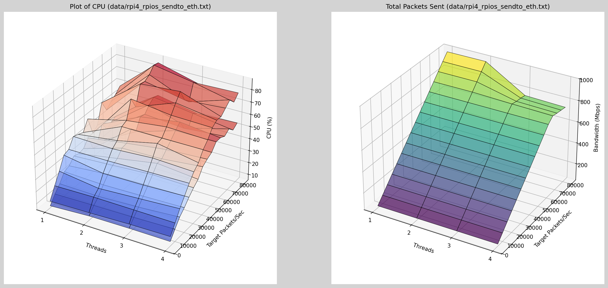
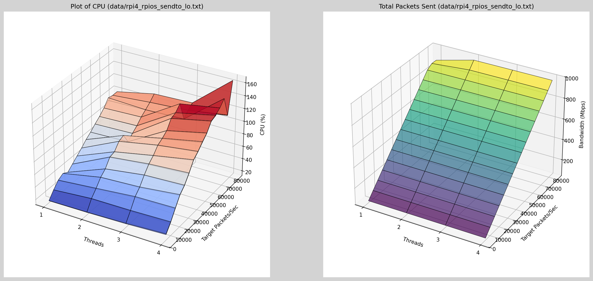
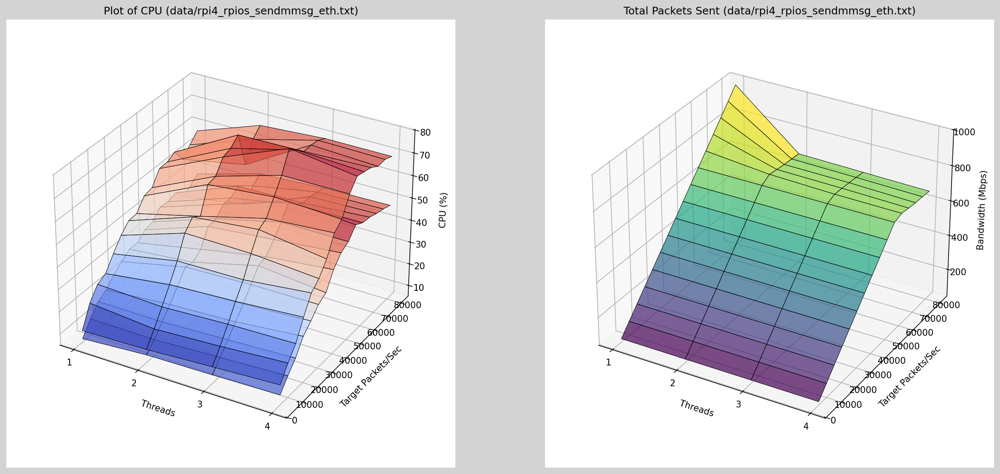
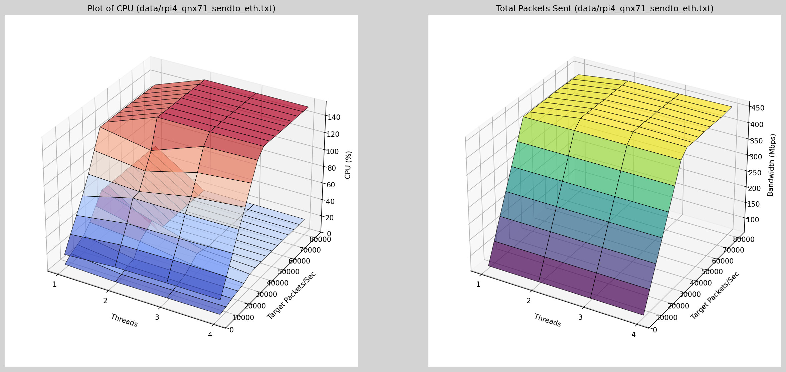
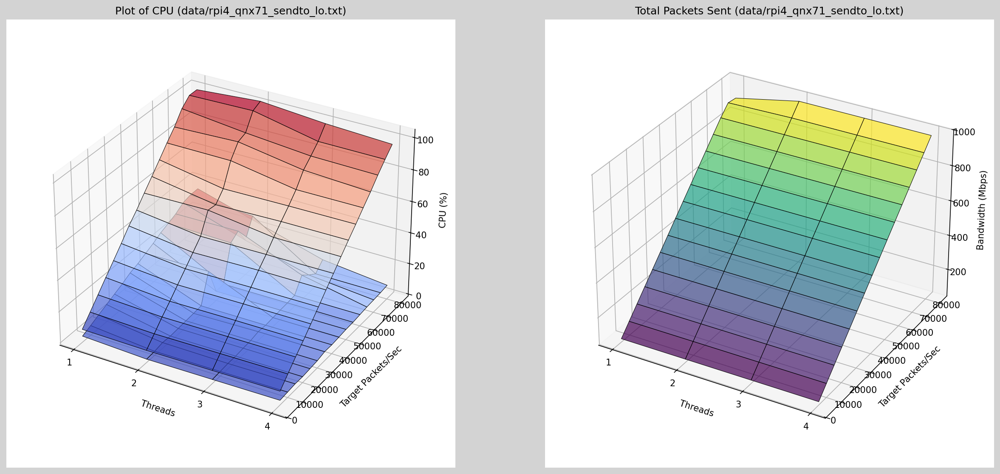
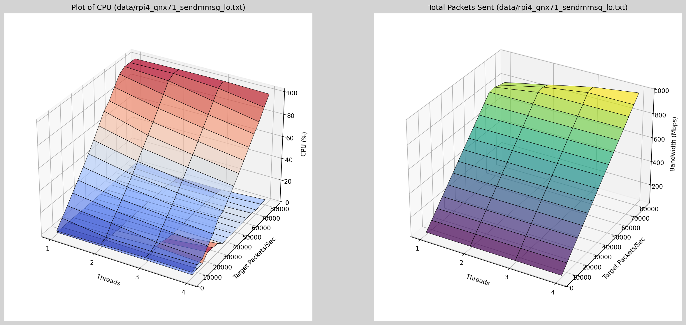
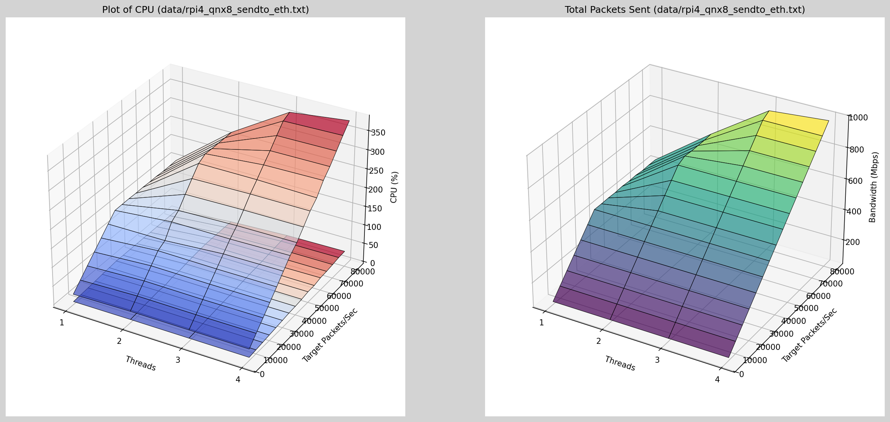
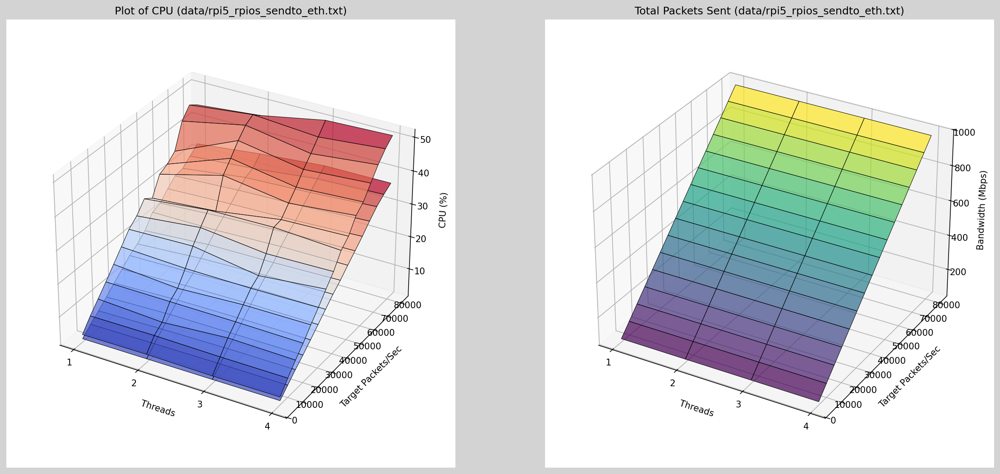
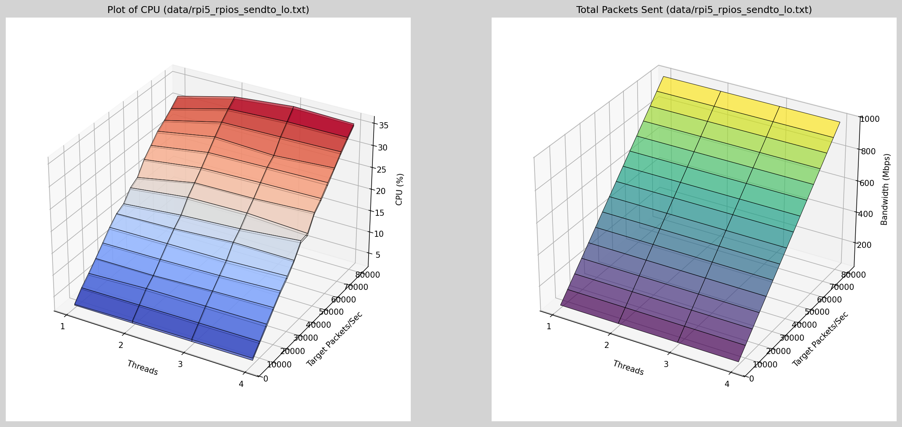
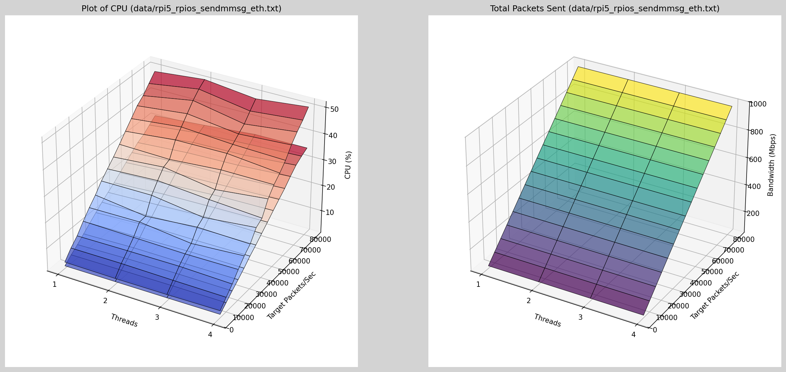

# Results of Rasbperry Pi4 <!-- omit in toc -->

- [1. Capture](#1-capture)
  - [1.1. Packet Sizes](#11-packet-sizes)
- [2. Results](#2-results)
  - [2.1. Raspberry Pi 4](#21-raspberry-pi-4)
    - [2.1.1. Linux](#211-linux)
      - [2.1.1.1. sendto](#2111-sendto)
      - [2.1.1.2. sendmmsg](#2112-sendmmsg)
    - [2.1.2. QNX 7.1 (io-pkt)](#212-qnx-71-io-pkt)
      - [2.1.2.1. sendto](#2121-sendto)
      - [2.1.2.2. sendmmsg](#2122-sendmmsg)
      - [2.1.2.3. BPF interface (Layer 2)](#2123-bpf-interface-layer-2)
    - [2.1.3. QNX 8.0.2 (io-sock)](#213-qnx-802-io-sock)
      - [2.1.3.1. sendto](#2131-sendto)
      - [2.1.3.2. sendmmsg](#2132-sendmmsg)
      - [2.1.3.3. BPF interface (Layer 2)](#2133-bpf-interface-layer-2)
    - [2.1.4. FreeBSD 14.2](#214-freebsd-142)
      - [2.1.4.1. sendto](#2141-sendto)
      - [2.1.4.2. sendmmsg](#2142-sendmmsg)
      - [2.1.4.3. BPF interface (Layer 2)](#2143-bpf-interface-layer-2)
    - [2.1.5. NetBSD 10.1](#215-netbsd-101)
      - [2.1.5.1. sendto](#2151-sendto)
      - [2.1.5.2. sendmmsg](#2152-sendmmsg)
      - [2.1.5.3. BPF interface (Layer 2)](#2153-bpf-interface-layer-2)
  - [2.2. Raspberry Pi 5](#22-raspberry-pi-5)
    - [2.2.1. Linux](#221-linux)
      - [2.2.1.1. sendto](#2211-sendto)
      - [2.2.1.2. sendmmsg](#2212-sendmmsg)

## 1. Capture

When running the measurements, ensure that no unnecessary processes are running,
that the background CPU load is 0%. Do not use the graphics subsystem,
preferring instead to run the tests via a SSH or Serial console instead, as
graphics sessions can cause CPU spikes in the background.

The best way is to use a script similar to the `contrib/linux_test.sh` that runs
the program multiple times for a fixed set of cores. Increasing the number of
cores may allow higher bandwidth throughput if the underlying network stack has
no serialisation of the data.

A text file of the output is captured, and then given to the [Jupyter Notebook
graph.ipynb](./graph.ipynb) that can be tweaked to generate the outputs for
analysis.

### 1.1. Packet Sizes

The packet size is set to 1472 bytes, sent over an untagged network, so that the
data sent out on the wire is maximised. Typical CPU load of a system should be
dependent on the number of packets in the system (and not the packet size).

| Frame Part              | Minimum Frame Size | Maximum Frame Size |
| ----------------------- | ------------------ | ------------------ |
| Interframe Gap (9.6ms)  | 12 bytes           | 12 bytes           |
| MAC Preamble (+SFD)     | 8 bytes            | 8 bytes            |
| MAC Destination Address | 6 bytes            | 6 bytes            |
| MAC Source Address      | 6 bytes            | 6 bytes            |
| MAC Type                | 2 bytes            | 2 bytes            |
| Payload                 | 46 bytes           | 1500 bytes         |
| CRC                     | 4 bytes            | 4 bytes            |
| *TOTAL*                 | 84 bytes           | 1538 bytes         |

Thus, the maximum number of packets that physically can be sent to saturate a
1Gbps link is 81,274 packets/sec (1,000,000,000 / (1538 * 8)).

## 2. Results

### 2.1. Raspberry Pi 4

All tests were run on a Raspberry Pi 4, 8GB model with a 1Gbps link to a switch
using the integrated controller. The frequency of the RPi4 is set to 1500MHz so
that comparisons between Operating Systems are meaningful (newer updates
overclock the Raspberry Pi).

Tests were done with the Ethernet controller and the Loopback device (to see the
overhead the device driver introduces as well).

#### 2.1.1. Linux

##### 2.1.1.1. sendto

Shows that single-threaded performance is the best. Real-world applications with
multiple processes/threads sending data have problems with the driver. The
application and kernel takes 35% CPU, where the system has an additional 20% CPU
overhead. This is due to the driver being tested, as when testing with Loopback,
this overhead is not present.

The bandwidth limit resulting in about 55% is approximately 540Mbps.

The network hardware is the limiting factor, where in software only, 1Gbps can
be reached with about 105% CPU (2 threads).

##### 2.1.1.2. sendmmsg

#### 2.1.2. QNX 7.1 (io-pkt)

##### 2.1.2.1. sendto

Under QNX 7.1, the bandwidth limits to 450Mbps at 140% CPU. As the number of
threads increase, the bandwidth and CPU only marginally increase. This can be
explained by the single-threaded implementation of `io-pkt` (the extra bandwidth
achieved from 1 to 2 threads can be explained by the overhead in the message
passing system and the resource manager implementation). Remember, that there
are two context switches per blocking `sendto` call in this particular test.

On the graph on the left, most of the overhead is in the `io-pkt` itself. The
application running has higher CPU for a single threaded sender (with less
throughput indicating it is CPU bound) where with two threads most time is
waiting on `io-pkt`.

For the same bandwidth, QNX requires 3x more CPU.

The behaviour of networking timing is more predictable (given sufficient CPU
resources).

When testing the loopback device, we see that it's possible to achieve 1Gbps
under QNX with idle time to spare, indicating a lot of work being done by the
driver.

Again, the hardware is the limiting factor, with the loopback device achieving
similar performance to Linux of 1Gbps with 102% CPU.

##### 2.1.2.2. sendmmsg

We can see that the `sendmmsg()` call is more efficient by a reduction of 20%
CPU for the same bandwidth. The overhead of the application itself is less (with
more time being spent in `io-pkt`) which is to be expected due to the reduction
of messages (going from up to 80,000 calls per second in the maximum use case,
to 200 calls per second with m=5ms).

The overall bandwidth is not increased significantly.

##### 2.1.2.3. BPF interface (Layer 2)

The performance is similar to `sendto` and `sendmmsg` with slight degredation
overall (but slightly better single threaded performance). Software calculates
the UDP and IPv4 checksums directly on the generated packets.

This interface does not work on the loopback device.

#### 2.1.3. QNX 8.0.2 (io-sock)

##### 2.1.3.1. sendto

With QNX8 and the introduced `io-sock`, multithreaded behaviour can be observed
with ability to reach with 2 threads 890Mbps at 250% CPU, or slightly better
(but not maximum performance) of 3 threads 902Mbps with 320% CPU.

The CPU overhead of io-sock in a multithreaded environment is significantly
higher for the same bandwidth.

Comparing a single thread of `io-pkt` with a single thread of `io-sock` is
similar performance (QNX 7.1 at 140% CPU, QNX 8 at 135% CPU for slightly lower
bandwidth). But to now double the bandwith, more than double the CPU is
required with 2 threads or more.

The single threaded performance of `io-sock` with the loopback is half the
performance of `io-pkt`.

##### 2.1.3.2. sendmmsg

##### 2.1.3.3. BPF interface (Layer 2)

#### 2.1.4. FreeBSD 14.2

FreeBSD will return quite often `ENOBUFS`, which are shown is a period `.` in
the logs while testing (once per interval).

##### 2.1.4.1. sendto

##### 2.1.4.2. sendmmsg

##### 2.1.4.3. BPF interface (Layer 2)

#### 2.1.5. NetBSD 10.1

NetBSD may send `ENOBUFS`, but this is rarer as found in FreeBSD. The CPU load
is shown as less than 100% in the tests, indicating the methods used for testing
are not optimised.

##### 2.1.5.1. sendto

Total CPU measurements on NetBSD are not reliable, and so are not shown in the
graphs. NetBSD is not able to reach full network saturation with the tests.

Even though it is clear that the CPU is not saturated, it is dropping packets
indicating tuning of the network stack can produce better performance.

##### 2.1.5.2. sendmmsg

##### 2.1.5.3. BPF interface (Layer 2)

The NetBSD 10.1 deadlocks in the `writev` method when running with more than one
thread, so there is no data to show. When this occurs, the SSH session usually
exits also.

### 2.2. Raspberry Pi 5

#### 2.2.1. Linux

##### 2.2.1.1. sendto

The Raspberry Pi 5 is a significant upgrade for network performance over the
Rasbperry Pi 4, comparing the two Linux implementations.

##### 2.2.1.2. sendmmsg

